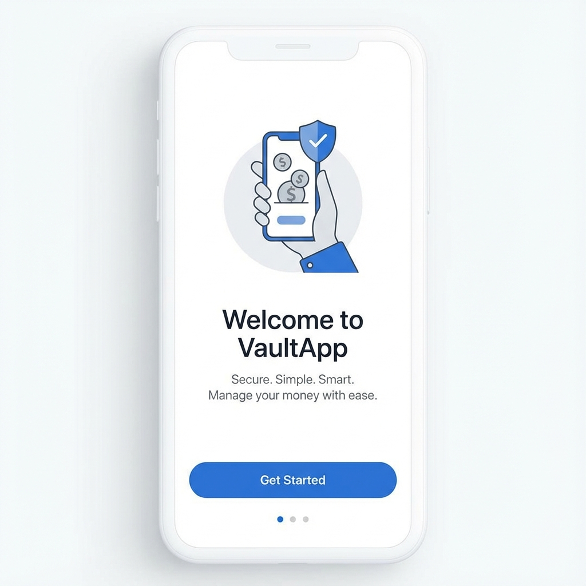
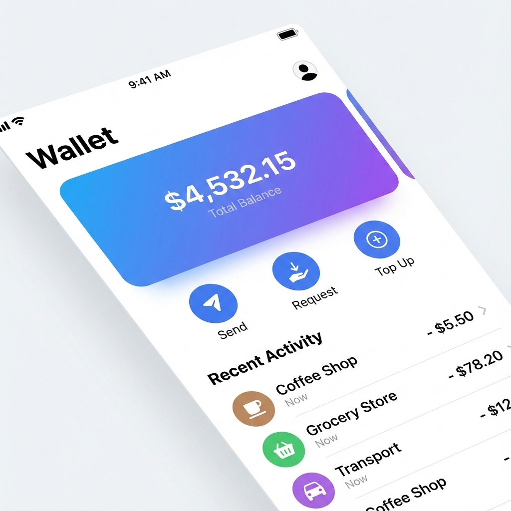
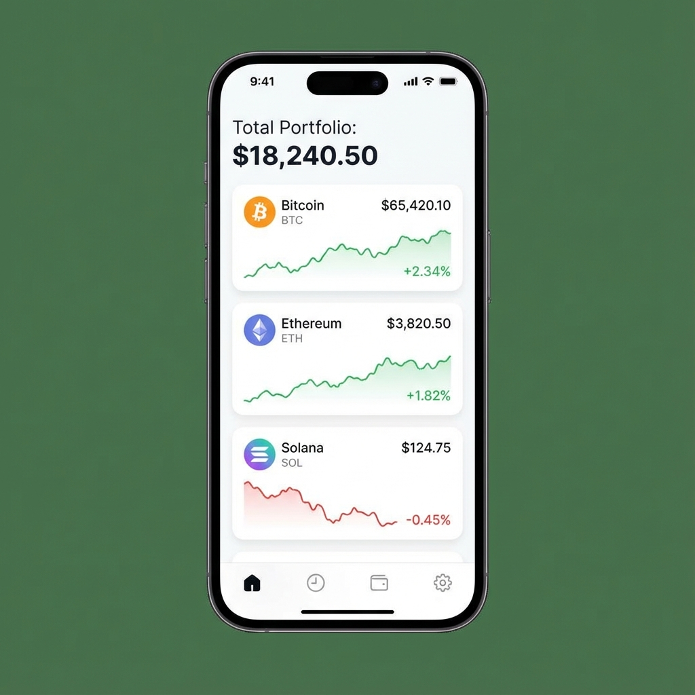
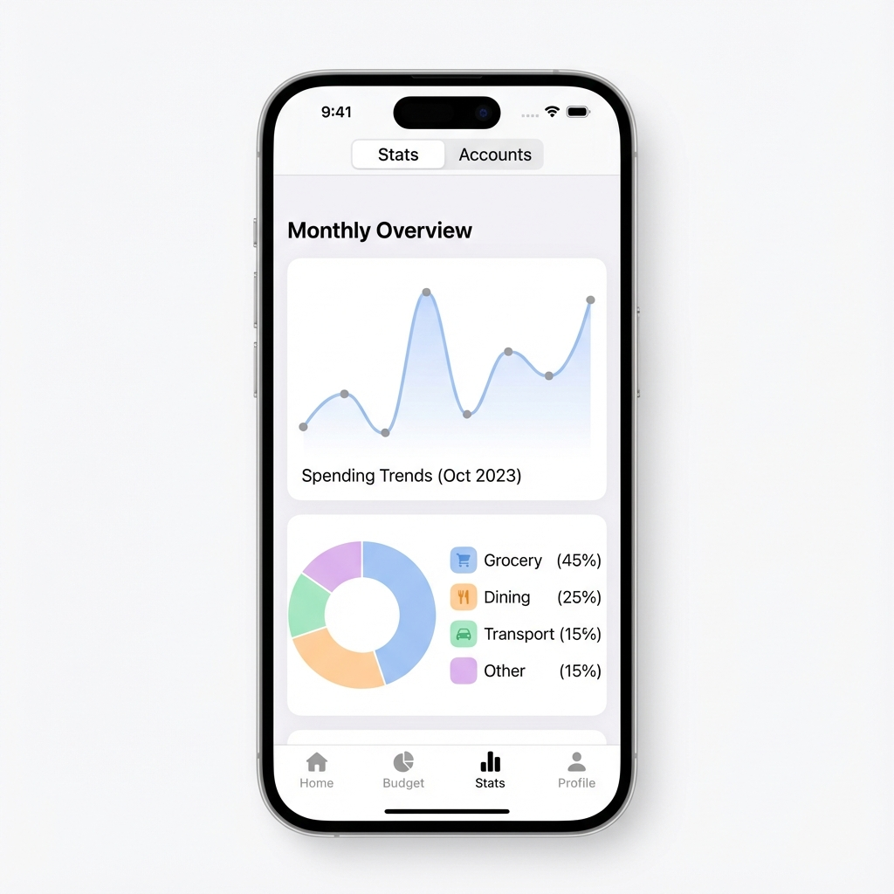
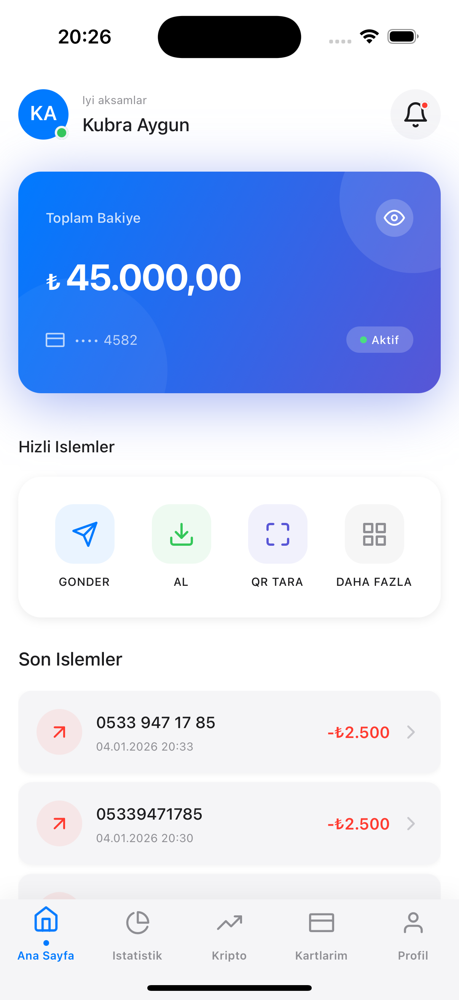

# WalletApp

Modern, guvenli ve kullanici dostu bir mobil cuzdan uygulamasi.


---

## Onizleme (Showcase)

<p align="center">
  
  
  
  
  
  
</p>

---

## Ozellikler

- **Para Transferi** - Telefon numarasiyla hizli para gonderme
- **Harcama Grafikleri** - Aylik harcama analizi ve kategorilendirme
- **Kripto Takibi** - Canli kripto para fiyatlari ve trendler
- **QR Kod Tarama** - QR ile aninda odeme baslatma
- **Biyometrik Giris** - Face ID / Touch ID destegi
- **Kart Yonetimi** - Sanal kart olusturma ve yonetme
- **Doviz Cevirici** - Anlik doviz kuru hesaplama
- **Coklu Dil Destegi** - Turkce ve Ingilizce destegi

## Tasarim Sistemi

- **Minimal White Tema** - Apple Pay tarzi temiz ve modern arayuz
- **Interaktif Animasyonlar** - Lottie ve Reanimated ile akici gecisler
- **Glassmorphism** - Buzlu cam efektli modern bilesenler
- **Dark Mode Hazirligi** - Koyu mod uyumlu renk paleti

## Teknolojiler

| Kategori         | Teknoloji                     |
| ---------------- | ----------------------------- |
| Framework        | React Native 0.81 + Expo 54   |
| State Management | Redux Toolkit + Redux Persist |
| Navigation       | React Navigation 7            |
| API              | Axios                         |
| Charts           | react-native-chart-kit        |
| Animations       | react-native-reanimated 4     |
| Secure Storage   | expo-secure-store             |
| Error Tracking   | Sentry                        |
| i18n             | i18next + react-i18next       |

## Kurulum

```bash
# Bagimlilikiari yukle
npm install --legacy-peer-deps

# Gelistirme sunucusunu baslat
npx expo start --android --clear
```

## Lisans

Bu proje [0BSD](LICENSE) lisansi altindadir.

## Gelistirici

**Kubra Aygun**

---

Bu projeyi begendiniyseniz yildiz vermeyi unutmayin!
